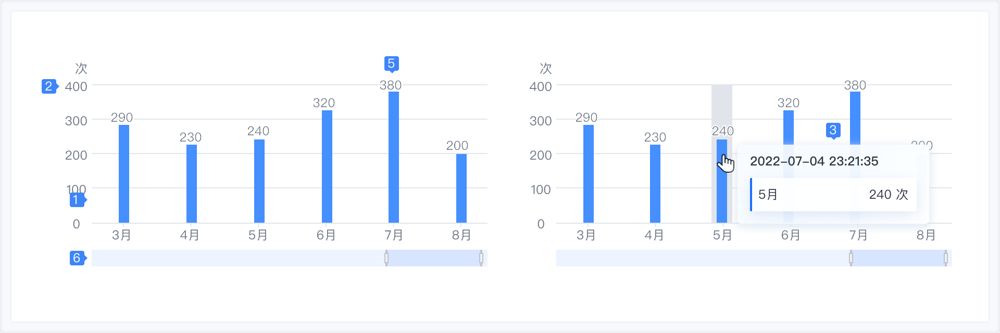
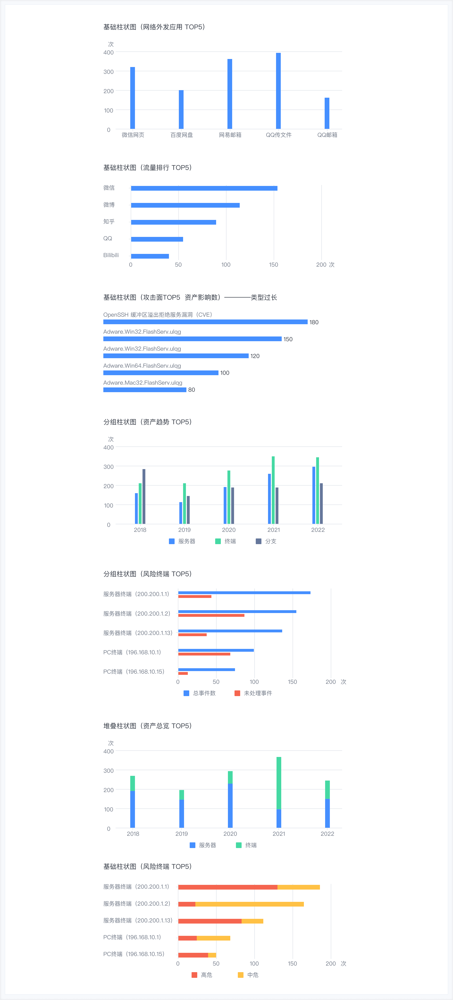

### 使用场景

柱状图借助与本身高度，能够较清晰的反应数据之间的差异性，一般会用作不同角色间的对比关系，同时也可用来反应变化趋势。通常来说，柱状图的横轴更多会展示时间维度，用户会习惯性的认为存在时间趋势。 分类数据不宜过多，建议不超过 20 条，如有多组分类数据，建议不超过 10 组。

### 组件构成

| 序号 | 名称             | 说明                                                                                           |
| ---- | ---------------- | ---------------------------------------------------------------------------------------------- |
| 1    | 图形             | 连接各个数据点的线。                                                                           |
| 2    | 坐标轴           | 当鼠标悬停在图形上时，以提示框的形式展示该点的数据，帮助用户快速获取图形的关键数据。           |
| 3    | 提示信息         | 当鼠标悬停在图形上时，以提示框的形式展示该点的数据，帮助用户快速获取图形的关键数据。           |
| 4    | 图例（可选）     | 对当前的一组数据进行的内容标注。                                                               |
| 5    | 数据标注（可选） | 对当前的一组数据进行的内容标注。                                                               |
| 6    | 缩略轴（可选）   | 可以缩小宏观看数据全貌，又可以放大微观看数据的片断，同时还可以拖拽观察数据在一定区间内的演变。 |

### 组件类型

### 与其他图表的对比

对比折线图、饼图

- 柱状图主要用于多个分类间的数据（大小、数值）的对比；
- 折线图主要用于展示连续数值（例如时间）或者有序分类的变化趋势；
- 饼图主要是展示分类之间的占比情况。

对比南丁格尔图（玫瑰图）

- 南丁格尔图（玫瑰图）通过半径的大小来对比数据；
- 柱状图根据矩形的长度来对比数据。
