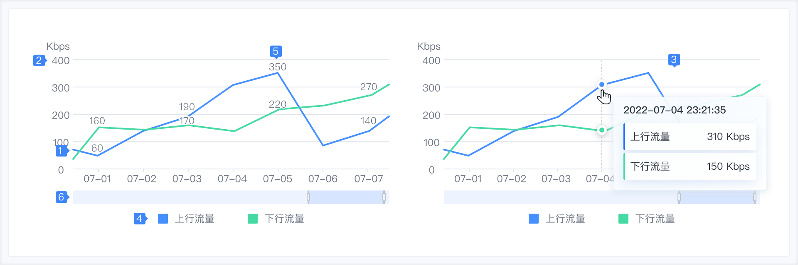
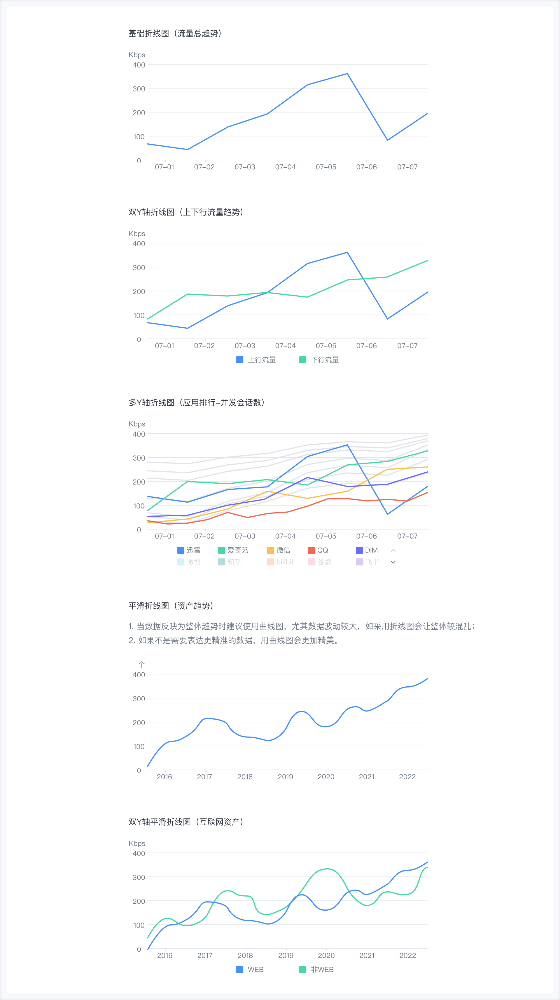

### 使用场景

在折线图中，数据是递增还是递减、增减的速率、增减的规律（周期性、螺旋性等）、峰值等特征都可以清晰地反映出来。所以，折线图常用来分析数据随时间的变化趋势，也可用来分析多组数据随时间变化的相互作用和相互影响。例如可用来分析上下行流量随时间变化的情况，从而进一步预测未来的流量情况，在折线图中，一般水平轴（X 轴）用来表示时间的推移，并且间隔相同；而垂直轴（Y 轴）代表不同时刻的数据的大小。

### 组件构成

| 序号 | 名称             | 说明                                                                                           |
| ---- | ---------------- | ---------------------------------------------------------------------------------------------- |
| 1    | 图形             | 连接各个数据点的线。                                                                           |
| 2    | 坐标轴           | 当鼠标悬停在图形上时，以提示框的形式展示该点的数据，帮助用户快速获取图形的关键数据。           |
| 3    | 提示信息         | 当鼠标悬停在图形上时，以提示框的形式展示该点的数据，帮助用户快速获取图形的关键数据。           |
| 4    | 图例（可选）     | 对当前的一组数据进行的内容标注。                                                               |
| 5    | 数据标注（可选） | 对当前的一组数据进行的内容标注。                                                               |
| 6    | 缩略轴（可选）   | 可以缩小宏观看数据全貌，又可以放大微观看数据的片断，同时还可以拖拽观察数据在一定区间内的演变。 |

### 组件类型

### 与其他图表的对比

对比面积图

- 折线图和面积图都可以表示一段时间（或者有序分类）的趋势，相比之下面积图的表现力更强一些；
- 面积图还可以表示数据的上下限，例如可以表示温度的最小值、最大值。

对比柱状图

- 柱状图主要用于多个分类间的数据（大小、数量）的对比，折线图主要用于时间或者连续数据上的趋势；
- 分类间的数据比较，如果分类不存在顺序，那么不要使用折线图。
