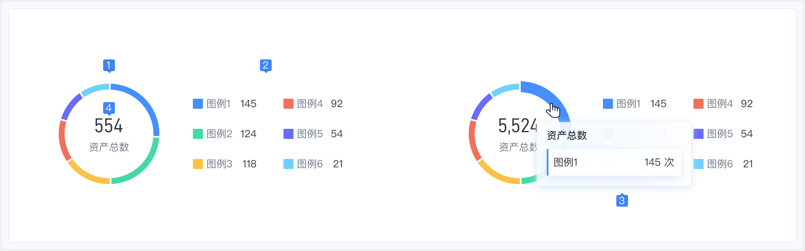
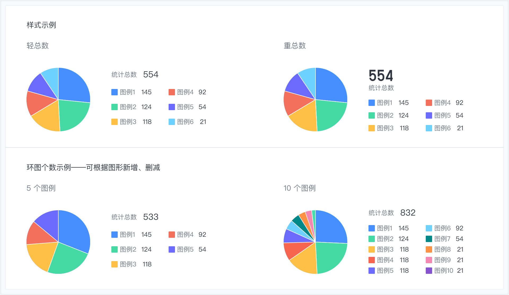
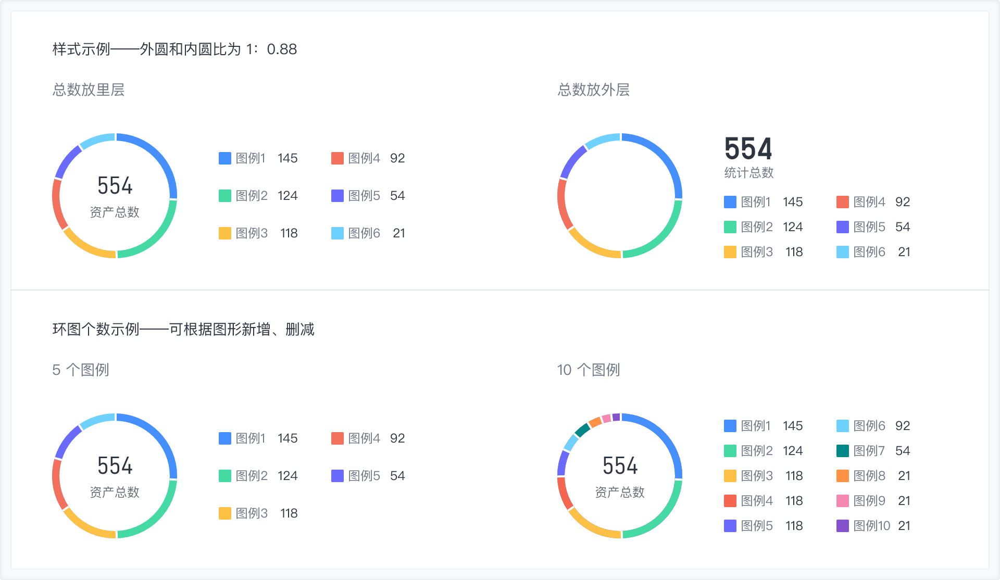
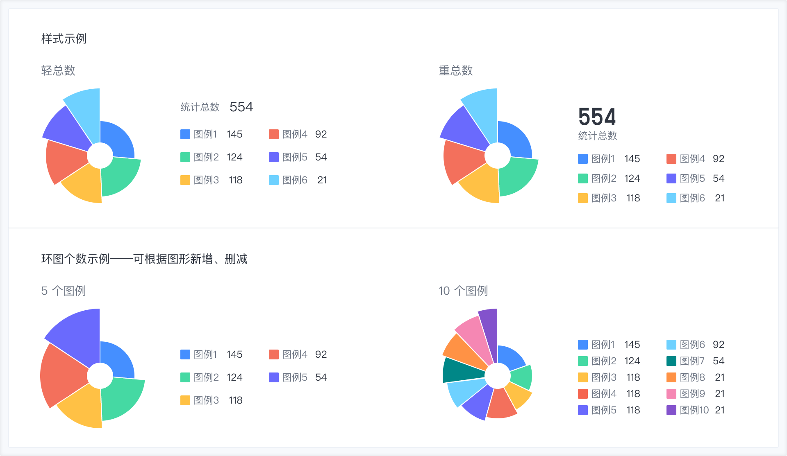
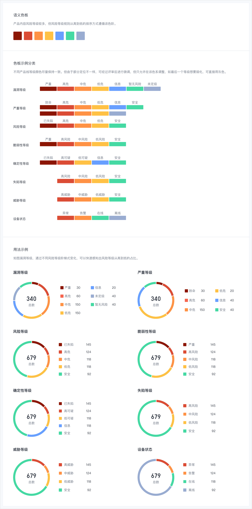

### 使用场景

常用于不超过 10 种分类，且总和为 100%的分类对比，如安全事件、风险业务、资产分布等。

### 组件构成

| 序号 | 名称             | 说明                                                                                 |
| ---- | ---------------- | ------------------------------------------------------------------------------------ |
| 1    | 图形             | 氛围饼图、环形饼图、南丁格尔玫瑰图，根据场景需求选择饼图类型。                       |
| 2    | 图例             | 用于解释图表中的分类维度信息。                                                       |
| 3    | 提示信息         | 当鼠标悬停在图形上时，以提示框的形式展示该点的数据，帮助用户快速获取图形的关键数据。 |
| 4    | 统计总数（可选） | 数据总数，可根据场景放置。                                                           |

### 组件类型

| 名称           | 说明                                                                       |
| -------------- | -------------------------------------------------------------------------- |
| 基础饼图       | 饼图通过弧度的大小来对比数据。                                             |
| 环形饼图       | 由饼图将中间区域挖空，视觉上比饼图更加轻量，通过区块弧长对比数据。         |
| 南丁格尔玫瑰图 | 通过圆弧的半径长短表示数据的大小，比基础饼图和环形饼图展示更多的分类数据。 |

- 基础饼图

- 环形饼图

- 南丁格尔玫瑰图

### 语义色板

用于风险等级的配色等。

### 与其他图表的对比

对比柱状图

- 饼图主要是展示分类之间的占比情况。
- 而柱状图主要展示各个分类数量、大小的对比。
